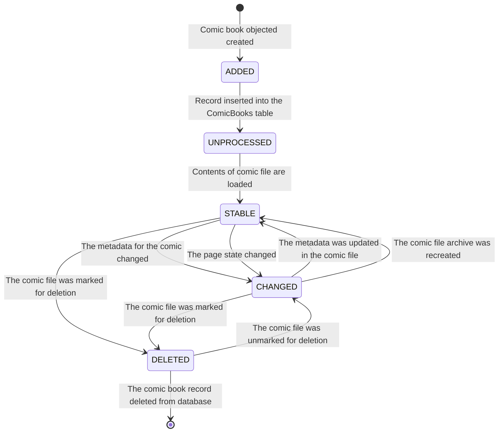

# Overview

## Comic Books

This diagram describes the state changes for comics as events occur.

```mermaid
stateDiagram-v2
   [*] --> ADDED: Comic book objected created
   ADDED --> UNPROCESSED: Record inserted into the ComicBooks table
   UNPROCESSED --> STABLE: Contents of comic file are loaded
   STABLE --> CHANGED: The metadata for the comic changed
   STABLE --> CHANGED: The page state changed
   CHANGED --> STABLE: The metadata was updated in the comic file
   CHANGED --> STABLE: The comic file archive was recreated
   STABLE --> DELETED: The comic file was marked for deletion
   CHANGED --> DELETED: The comic file was marked for deletion
   DELETED --> CHANGED: The comic file was unmarked for deletion
   DELETED --> [*]: The comic book record deleted from database
```
