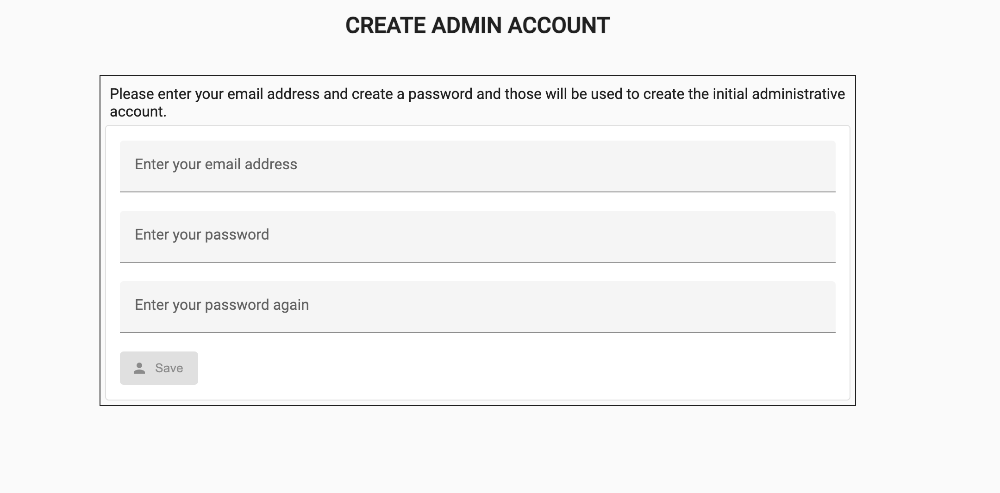
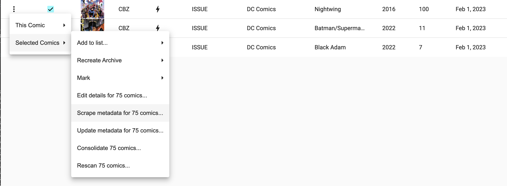

# Overview

This document is to help you go from 0 to running the ComiXed application on your system.

# Installation

## Prerequisites

### Java Runtime Environment

As of v2.0, ComiXed requires Java 17 or later, and will not run with any
version prior to that. Since Oracle no longer ships a JRE (Java Runtime
Environment) for Java after 9, you'll instead need to download a Java
Development Kit (JDK) from [here](https://www.oracle.com/java/technologies/javase/jdk12-archive-downloads.html).

### Database Support

ComiXed makes heavy use of databases to manage the information for a
comic book library. As such, it requires one that provides a stable,
durable environment.

ComiXed ships with support for two database environments:
 * [MySQL](https://www.mysql.com/) v8.1 or later
 * [PosgreSQL](https://www.postgresql.org/) v16.0 or later

It also ships with support for the embedded H2 database. However, it is
**strongly** recommended that you do not use this embedded database for
long term data management. It is included to make it easier to evaluate
the ComiXed project and is **not** a supported feature.

See the section below on configuration for how to enable support for one
of the external database systems.

# Installing The Server

To install ComiXed, simply extract the [release bundle](https://github.com/comixed/comixed/releases)
in the directory from which you wish to run it. Several directories are created:

 * **$ROOT/bin** which contains the scripts to launch the server, along with the main code,
 * **$ROOT/config** which contains the example external configuration file,
 * **$ROOT/docs** which contains any documentation, as well as the project's license, and
 * **$ROOT/lib** which will hold any plugins, external libraries, and extensions. 


# Configuring The Application

## Using An External Configuration File

The JAR file contains the default **application.properties** file, which
controls the runtime of the application. However, an external configuration
can be used, allow you to override default values. This file is:

    $ROOT/config/application.properties-example

where **$ROOT** is the directory where the release was copied. Simply copy
this file to:

    $HOME/.comixed/application.properties

| OS      | $HOME LOCATION                         |
|---------|----------------------------------------|
| Windows | ```C:\users\YOURUSERNAME\\.comixed```  |
| Linux   | ```/home/YOURUSERNAME/.comixed```      |
| MacOS   | ```/Users/YOURUSERNAME/.comixed```     |

Copy the file and edit the contents. When you restart the server, this
configuration will be used instead. And, when a new release comes out,
you'll want to make sure to copy your changes into it and replace this
file.


## Using An External Database

To enable using an external database, edit the external configuration file
and comment out the section that defines the H2 environment

Then, depending on which environment you plan to use, either uncomment the
MySQL or the Postgres options. Then you will need to provide the name of
server, the username, and the password for that user that will be used to
manage the database.

It's beyond the scope of this document to show how to do these steps. But
you can always check the comixed mailing list archives for where others
have described how to do these steps.


## Adding Extensions And Plugins

ComiXed supports adding features and functionality through the use of extensions
and plugins.

For example, to scrape comic book metadata, such as the cover date,
writer and artist, or other details for a comic, you can use the 
[ComiXed ComicVine Metadata Adaptor](https://github.com/comixed/comixed-metadata-comicvine)
extension.

Referring to the $HOME location described earlier in
[Configurating The Application](#configuring-the-application), the following
lists the directories used:

| Type       | Directory                 |
|------------|---------------------------|
| Extensions | $HOME/.comixed/extensions |
| Plugins    | $HOME/.comixed/plugins    |


# Launching The Application

To run the application, use one of the following options from the **bin**
directory where you installed the product:

## Linux Or Mac
```
 $ sh ./run.sh
```

## Windows
```
 C:\users\comixed> run.bat
```

This will launch the application in the current window as a text-only
application. You'll see output as the application starts, creates your
library database (when run the first time). When you see the following
text, the application is ready for the next step:

```
2018-07-24 08:38:44.509  INFO 75198 --- [           main] o.s.j.e.a.AnnotationMBeanExporter        : Registering beans for JMX exposure on startup
2018-07-24 08:38:44.520  INFO 75198 --- [           main] o.s.c.support.DefaultLifecycleProcessor  : Starting beans in phase 0
2018-07-24 08:38:44.640  INFO 75198 --- [           main] s.b.c.e.t.TomcatEmbeddedServletContainer : Tomcat started on port(s): 7171 (https) with context path ''
2018-07-24 08:38:44.644  INFO 75198 --- [           main] org.comixedproject.ComiXedApp            : Started ComiXedApp in 8.979 seconds (JVM running for 9.62)
```

# Logging In

## The First Account Is The Administrator

The first person to log into the server is granted administrator rights.

To create this administrator account, simply start the login process by
pointing your browser to the following URL (assuming you're running ComiXed
locally):

    http://localhost:7171/

You will see a page like this:



Enter the email address and the password for the account you wish to create,
and then submit the form. This will create a new account with administrator
privileges.

# Configuration and Feature Flags

Once you've created your administrator account, you can change the following
configuration options and feature flags. 

Navigate to the **Configuration** page and select the **Library** tab. There
you can set the following options:

| Option                                                  | Required | Description                                                                    |
|---------------------------------------------------------|----------|--------------------------------------------------------------------------------|
| **Delete empty directories after library organization** | No       | Removes any directories that are left empty after organizing your comic books  |
| **Create external metadata files for each comic**       | No       | Stores the comic's portable metadata as an external file next to the comic     |
| **Do not create or update internal metadata files**     | No       | Turns off storing metadata in the internal ComicInfo.xml file in each comic    |
| **Do not recreate comic files**                         | No       | Disables changing the physical files for all comic books                       |
| **Manage blocked pages**                                | No       | When enabled, the server will automatically mark any blocked page for deletion |
| **Comic Renaming Rule**                                 | Yes      | Defines the file naming rule when organizing your comic library                |
| **Page Renaming Rule**                                  | Yes      | Defines the file naming rule for individual pages within a comic file          |

# Importing Your Comic Library

To import your existing comic library, login as an admin and navigate to the
**Import Comics** page.

Click on the search button to enter the root directory and maximum number of
comics to find. The server will only return comics that are not already in
the library. 

Please be patient. Depending on the size of your existing library and the
number of files to process, this can take some time. However, once it finishe,
it will then present a list of comics found.

From this list, select those comic books to be added to the database. Then
simply click on the **Start Import** button.

**NOTE:** You will not be able to look for more comics to import while an
existing import is running. And while an import is running, some access to
the comics being processed won't be available. So it's a good idea to strike
a balance between how many comics you import in a single batch. A good rule
of thumb would be to import no more than 1,000 comics at a time.


## ComicInfo.xml Support

When importing comics, and if you select to do so, then all files that
contain the comicinfo.xml file will have the information contained in it
imported into your database. This way you won't have to rescrape sources
like the ComicVine database for those comics.

# Scraping Comics

## Before You Begin

Before you can scrape comics, you will need to:

1. install a comic metadascrape, and
1. configure the scraper.

The following is a short list of available comic metadata scrapers:

| Name                       | Supported Sources | Download Link                                         |
|----------------------------|-------------------|-------------------------------------------------------|
| ComiXed Metadata ComicVine | ComicVine         | https://github.com/comixed/comixed-metadata-comicvine |

Simply download the release and then place the JAR file in the extension
directory described [here](#adding-extensions-and-plugins).

To scrape comics, you can either scrape them individually or scrape across multiple comics.

## Scraping A Single Comic

The easiest way to scrape a single comic is to:
1. go to the comic book's details page,
1. click on the **Scraping** tab,
1. select a **Metadata Source**,
1. enter any missing required data for the comic, then
1. click the **Scrape this comic** button in the toolbar.

Once all of the data required is entered, click on the **Fetch** button below.

## Scraping Multiple Comics

To scrape more than one comic, go to any view listing comic books and select
the ones to be scraped. Then, from the action menu on the list, select the
option for multi-comic scraping:



You will then be taken to a page that shows the list of comics waiting to be
scraped, and the current comic to be scraped.

You can select any pending comic by simply clicking on its row in the queue.

You can remove a comic from the scraping queue by clicking on the trashcan
icon for that entry.


# Reading Your Library

## Open Publication Distribution System (OPDS) Support

ComiXed provides support for accessing a comic's library via an OPDS browser.

# Reading Comics Remotely

You can read comics from your library using any comic reader that supports
the [OPDS](https://opds.io/), such as [Chunky Reader](http://chunkyreader.com/).

To allow your reader to access the library, you will need either the hostname
or IP address for the computer running ComiXed. So, for example, if that
computers IP address is **192.168.1.29** then you would tell the reader:

    Hostname: https://192.168.1.29:7171/opds
    Username: [your login email address]
    Password: [your login password]

Please note that some readers (such as Chunky) assume the **/opds** portion
of the URL. SO if your reader does not see a reading list, try removing
**/opds** from the URL.

Then your reader should see, at least, a reading list named **All Comics**.
This list will allow you to read all comics in your library.

Future work will allow for different reading lists to be presented via OPDS.
Please stay tuned for those changes to arrive.
