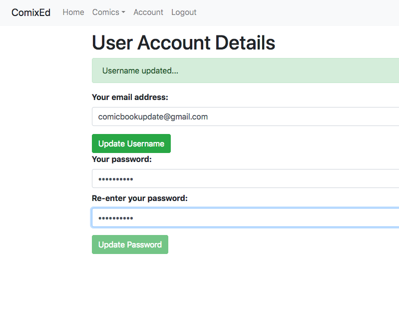
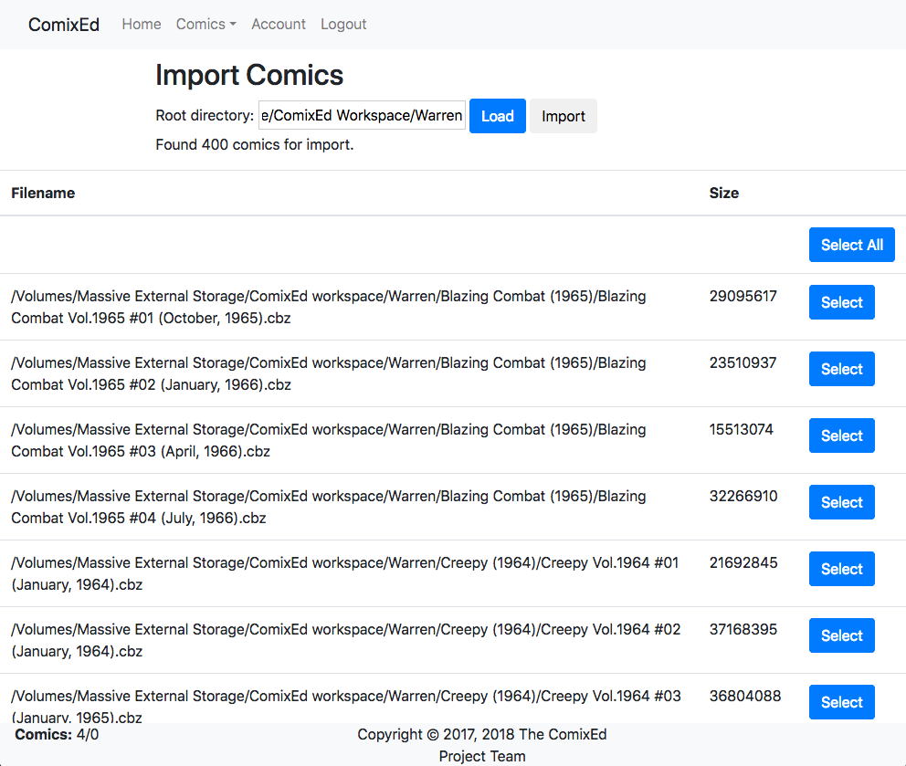
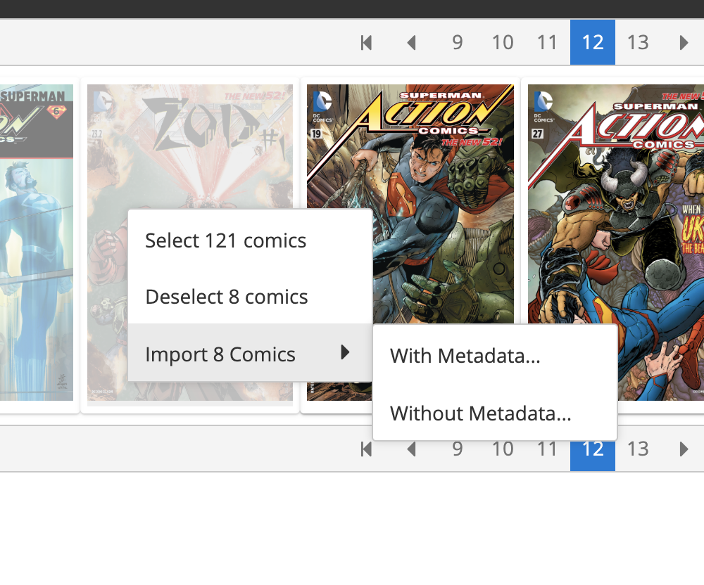
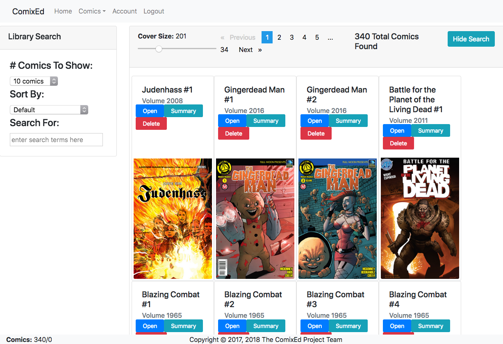
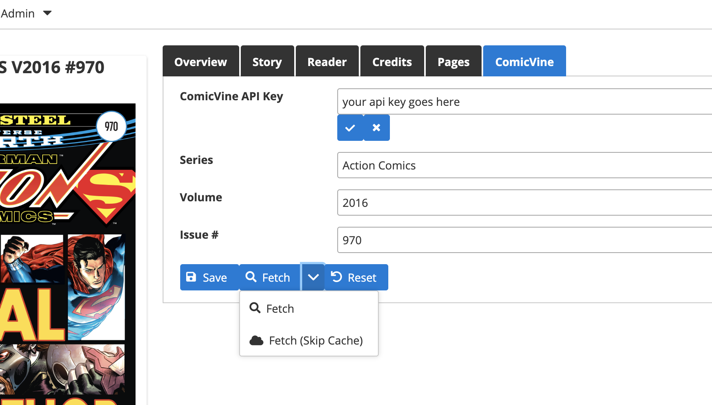
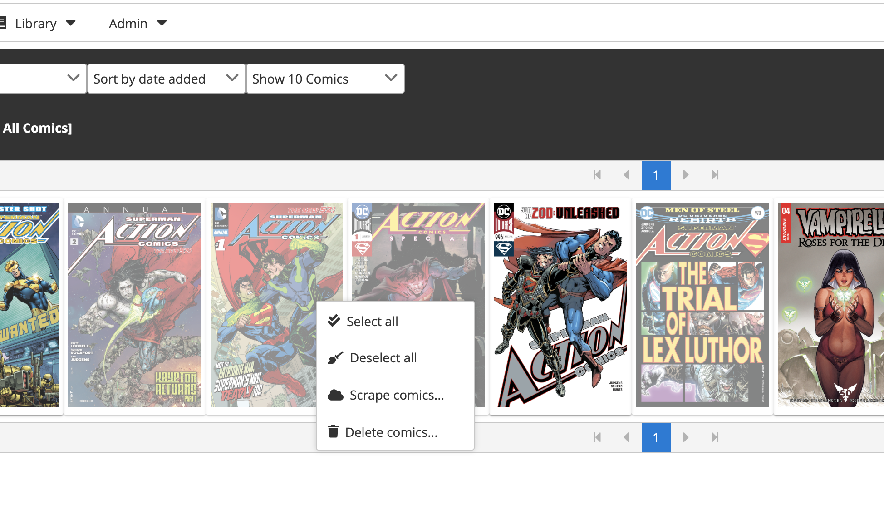
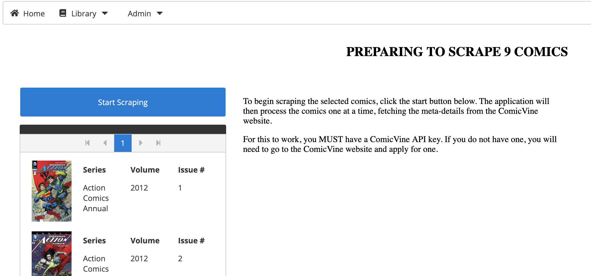
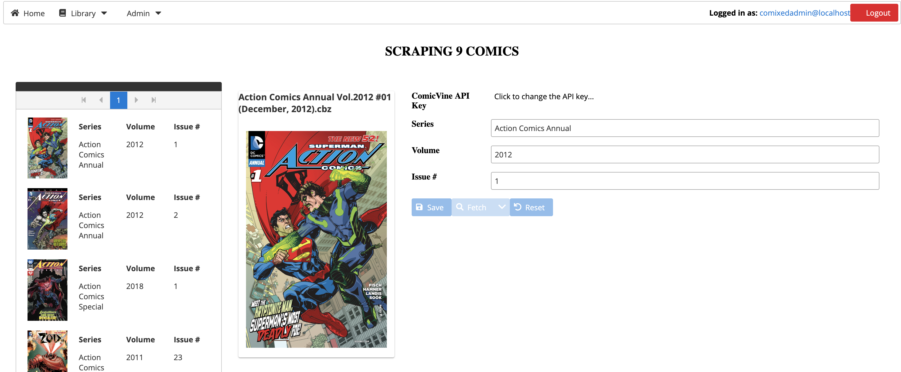

# Quick Start Guide

## Overview

This document is to help you go from 0 to running the ComiXed application on your system.

## Installation

To install the application, simply place the comixed-app-\*.jar file in the directory from which you would like to run it. The JAR file contains all of its dependencies, so you won't need to download any other files to run it: as long as you have Java 12 or later installed you can run the application.

### A Note On Java Requirements

As of v0.7, ComiXed requires Java 12 or later, and will not run with any version prior to that. Since Oracle no longer ships a JRE (Java Runtime Environment) for Java after 9, you'll instead need to download a Java Development Kit (JDK) from [here](https://www.oracle.com/java/technologies/javase/jdk12-archive-downloads.html).

## Configuring The Application

The JAR file contains the default **application.properties** file, which controls the runtime of the application.

By default, the application creates the runtime database, which contains your comic library, in:

* c:/users/[your name]/.comixed [on Windows]
* /home/[your name]/.comixed [on Linux, *nix]
* /Users/[your name]/.comixed [on Mac OS X]

## Launching The Application

To run the application use the following command line:

```
 $ java -jar [path to your JAR file]
```

This will launch the application in the current window as a text-only application. You'll see output as the application starts, creates your library database (when run the first time). When you see the following text, the application is ready for the next step:

```
2018-07-24 08:38:44.509  INFO 75198 --- [           main] o.s.j.e.a.AnnotationMBeanExporter        : Registering beans for JMX exposure on startup
2018-07-24 08:38:44.520  INFO 75198 --- [           main] o.s.c.support.DefaultLifecycleProcessor  : Starting beans in phase 0
2018-07-24 08:38:44.640  INFO 75198 --- [           main] s.b.c.e.t.TomcatEmbeddedServletContainer : Tomcat started on port(s): 7171 (http)
2018-07-24 08:38:44.644  INFO 75198 --- [           main] org.comixedproject.ComiXedApp            : Started ComiXedApp in 8.979 seconds (JVM running for 9.62)
```

### Enabling Extra Logging

Sometimes you might want (or need) to capture some additional information to report a bug. To increase the amount of logging add the following commandline option:
```
 $ java -jar [path to your JAR file] --logging.level.org.comixedproject=DEBUG
```

To capture the logging to a file, you can add the following commandline option:
```
 $ java -jar [path to your JAR file] --logging.file=comixed.log
```

## Logging In And Configuring Your Account



When run for the first time, ComiXed creates two default accounts for logging into the system:

1. Username: comixedadmin@localhost Password: comixedadmin
1. Username: comixedreader@localhost Password: comixedreader

It is **highly** recommended that you change at least the passwords for these accounts.

To log into the system as the user **comixedadmin@localhost**, open your web browser and go to **http://localhost:7171** and log in.

Once logged in, click on the **Account** link at the top of the page. This will take you to the account page. You can then change your password, and your login name.

Once you've done this, you'll need to log back into the application using that new name and password.

## Importing Your Comic Library

To import your existing comic library, click on **Admin** -> **Import** to go to the import page.

Here you enter the root directory for where your comic library is stored. For example, **c:/users/reader/Comics** or **/Users/reader/Comics** and then click the **Load** button. This will scan the directory you entered and all child directories looking for all comic files not already in the library (you can run this multiple times to import new comics). When it finishes you'll see something like the following screen shot:



This will display *only* comics not already included in your library that are found in the directory and its subdirectories. You can now select individual comics by clicking on their cover, or right-click in the cover area and select one of the popup menu items:



When you're ready, you can then right-click on a cover and select to begin importing comics. You can either import the selected comics **with** or **without** metadata included in a **ComicInfo.xml** file if found in any comic.



As each comic is imported, your browser will be updated to show the newly added comic. 

### ComicInfo.xml Support

When importing comics, and if you select to do so, then all files that contain the comicinfo.xml file will have the information contained in it imported into your database. This way you won't have to rescrape sources like the ComicVine database for those comics.

## Scraping Comics

To scrape comics, you can either scrape them individually or scrape across multiple comics.

### What You Will Need

To scrape comics, you'll need to get a ComicVine API key. Go [here](https://comicvine.gamespot.com/forums/api-developers-2334/obtaining-api-key-1949403/) for more details on how to obtain one.

Once you have your API key, you'll need to enter during your first scrape. It will then be stored and automatically used for future scrapes.



When scraping any comic, the data that needs to be entered is the series name, the volume and the issue number for the comic to be scraped. And for most comics, these pieces of information can be determined from the filename. However, if it was not, or if it was incorrect, you can manually change it during the scraping process. 
 
### Scraping A Single Comic

The easiest way to scrape a single comic is to open its details view, and go to the **ComicVine** tab.

Once all of the data required is entered, click on the **Fetch** button below.

#### Caching Metadata

To reduce the amount of data needed, ComiXed will cache data its retrieved while scraping to use again. This *greatly* increases performance when you're scraping multiple issues from a single series.

This is why there are two buttons when fetching. The **Fetch** button will look to see if there is cached data for the current comic and only go to the ComicVine database if none is found. The **Fetch (Skip Cache)** will ignore the cache **for this comic** and just go to ComicVine directly, and then overwrite any locally cached data.

It's **highly** recommended that you use your cache and only skip it if the comic being scraped wasn't found locally.

### Scraping Multiple Comics

The core of a multi-comic scrape is described above. Here we'll describe how to select the comics and start the process.

#### Selecting Comics



To select comics to be scraped, simply click on the covers for comics. You can also right-click on the titles and toggle all selections on or off.

When you're ready to start scraping, select the **Scrape comics...** option. You'll be taken to the following view:



Here you can begin scraping by clicking the **Start Scraping** button.



As it scrapes, you'll see the running total of comics remaining to be scraped as well as the details for the current comic being processed.

#### WARNING

If you reload your browser, you **will** lose your list of remaining comics to be scraped. The list of comics is currently maintained in the browser, so reloading the browser will result in that list being lost.

Any comics already processed will keep their data, but all other comics that haven't been processed will need to be reselected.
